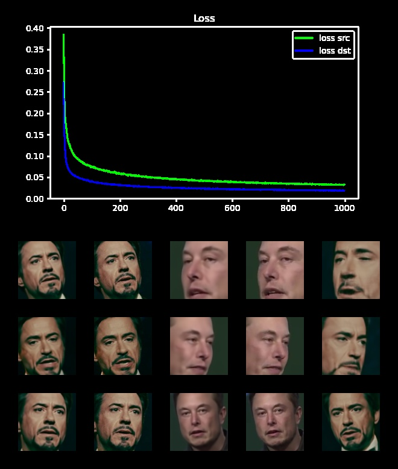

# Simplified DeepFaceLab based on torch

## setup environment
```bash
pip install gdown mediapipe
```

## prepare data
```bash
gdown 1-Vgcy8B5pzdMV2H8x9ZfuGSeufbw0CLA
gdown 1clK8KNiVRMmN4U2vMtHhJbKkJ6Ge7qGf
```

## Training
```
python train.py
```

